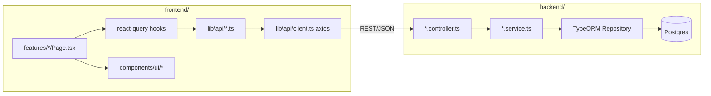
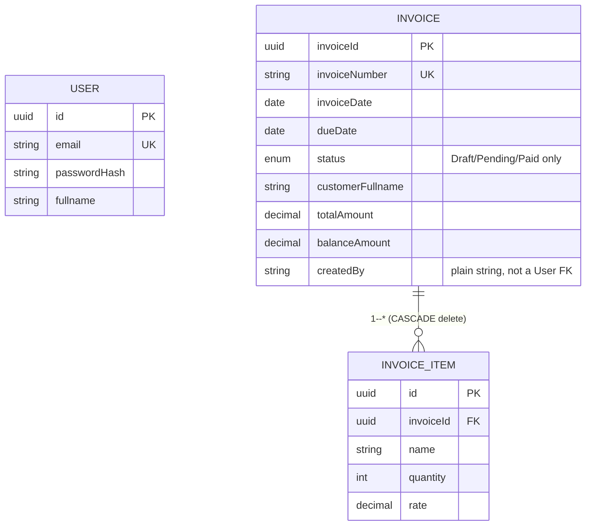
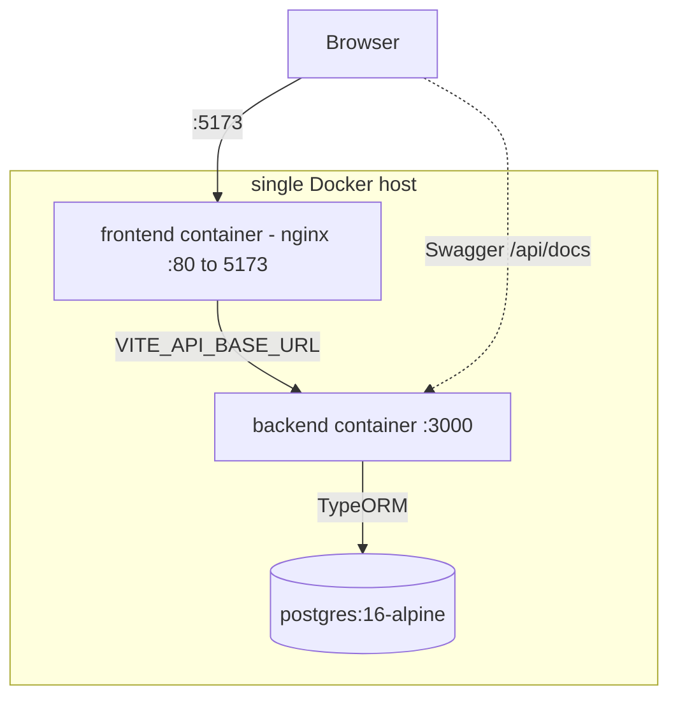

# Architecture — SimpleInvoice

*Baseline architecture spine ratifying the existing codebase (`backend/`: NestJS + TypeORM + Postgres; `frontend/`: React + Vite). Status: final, verified 2026-08-18 against commit `7d037d6`. Produced via BMad's architecture workflow — full run history, memlog, and reviewer output live under [`_bmad-output/planning-artifacts/architecture/architecture-my-assignment-2026-08-18/`](_bmad-output/planning-artifacts/architecture/architecture-my-assignment-2026-08-18/).*

## Design Paradigm

**Backend** (`backend/`): layered NestJS service architecture. `Controller → Service → TypeORM Repository`, one module per domain (`AuthModule`, `InvoicesModule`). Services are the only layer that touches a `Repository`; controllers only validate (`class-validator` DTOs) and delegate. No repository-abstraction layer beyond TypeORM's own.

**Frontend** (`frontend/`): feature-folder SPA. `features/auth`, `features/invoices` each own their pages and components. `@tanstack/react-query` owns all server-state (cache, refetch); `axios` (`lib/api/client.ts`) is a thin transport layer only — it never owns cache or retry policy. Forms use `react-hook-form` + `zod`. `components/ui/` supplies shadcn/radix primitives and is a dependency leaf — nothing there imports from `features/`.

## Invariants & Rules



### AD-1 — Frontend/backend boundary is REST-only

- **Binds:** all
- **Prevents:** frontend and backend release cycles coupling; implicit shared-package coupling
- **Rule:** [ADOPTED] Never introduce a shared types/code package between `frontend/` and `backend/`. The only coupling point is the REST API (contract documented via Swagger at `/api/docs`); each side keeps its own type definitions.

### AD-2 — Money calculation is server-side only

- **Binds:** invoices domain
- **Prevents:** client- and server-computed totals diverging
- **Rule:** [ADOPTED] `subTotal`/`taxAmount`/`totalAmount`/`balanceAmount` are computed only in `backend/src/invoices/invoices.service.ts` (`calculateTotals`). The frontend must never recompute or trust a locally-derived total — always render the server-returned value.

### AD-3 — Invoice status: Overdue is derived, never persisted

- **Binds:** invoices domain
- **Prevents:** an `Overdue` value being written to the DB; the list filter and the detail view disagreeing on what counts as overdue
- **Rule:** [ADOPTED] The `status` column only ever holds `Draft`/`Pending`/`Paid`. `Overdue` is derived at read time from `dueDate` vs. today in `InvoicesService.deriveStatus`, and mirrored separately in the list endpoint's query-builder status filter (SQL-side). Both derivations change together — there is no single shared implementation.

### AD-4 — Customer data is embedded on Invoice, not normalized

- **Binds:** invoices domain / data model
- **Prevents:** an independently-built feature introducing a `customers` table + join that nothing needs
- **Rule:** [ADOPTED] Customer fields (`customerFullname`, `customerEmail`, `customerMobileNumber`, `customerAddress`) live directly on the `invoices` row. No feature queries "all invoices for a customer" — if one ever does, that's a deliberate follow-up decision, not an incremental add. `customerEmail` is optional (validated when present, not required) and `currency`/`currencySymbol` accept any non-empty pair server-side even though the create-invoice UI restricts the picker to a fixed short list — both deliberate deviations from the original assessment spec.

### AD-5 — Invoice list query never joins `invoice_items`

- **Binds:** `GET /invoices` (list endpoint)
- **Prevents:** pagination count corruption from a one-to-many join combined with `skip`/`take`
- **Rule:** [ADOPTED] `Invoice.items` is `eager: true` (`backend/src/invoices/entities/invoice.entity.ts`) — a plain `repository.find()`/`findOne()` on `Invoice` auto-joins `invoice_items`. The list endpoint must keep using its manual query builder rather than the repository's default find methods; only the detail endpoint (`GET /invoices/:id`) is allowed to load items eagerly.

### AD-6 — No migrations at this stage

- **Binds:** backend / schema
- **Prevents:** one change landing via a migration file while another relies on `synchronize`, corrupting schema state
- **Rule:** [ADOPTED] `backend/src/config/typeorm.config.ts` runs with `synchronize: true`; schema changes happen through entity edits only. Never add `typeorm migration:*` files without first reversing this decision (real production use is the trigger).

### AD-7 — Authorization is session-only, not per-owner

- **Binds:** invoices domain
- **Prevents:** a feature silently assuming `createdBy` is an access-control boundary when it is audit metadata only
- **Rule:** [ADOPTED] Any authenticated user can read/write any invoice; `Invoice.createdBy` records who created it but is never checked on read or write. Multi-tenant or per-user scoping is Deferred (below) — do not add ownership checks to one endpoint without settling the model for all of them.

## Consistency Conventions

| Concern | Convention |
| --- | --- |
| Naming | DTO/entity fields are camelCase and carry the same name across the wire into the frontend TS types — no serialization renaming layer. |
| Data & formats | Dates (`invoiceDate`, `dueDate`) are `date`-only columns, no time component. Money is `decimal(12,2)`, never integer cents or float. Errors follow Nest's standard HTTP-exception JSON shape via the global `AllExceptionsFilter`. |
| State & cross-cutting (mutation, errors, logging, config, auth) | Auth is stateless JWT; the access token lives in `localStorage`, attached via an axios request interceptor. A `401` clears the session (`unauthorizedEvent` in `lib/api/auth-storage.ts`) and redirects to `/login` — there is no refresh-token flow. localStorage (vs. an httpOnly cookie) is accepted for this SPA-talks-to-a-separate-API shape; a system handling sensitive data would move to httpOnly cookies + CSRF instead. Every controller runs behind a global `ValidationPipe({ whitelist: true, forbidNonWhitelisted: true })` — unrecognized DTO fields are rejected, not silently dropped. CORS is fully open (`app.enableCors()`, no origin restriction). shadcn files under `frontend/src/components/ui/` are regenerated via the shadcn CLI, never hand-edited. |

## Stack

| Name | Version |
| --- | --- |
| NestJS (`@nestjs/common`/`core`/`platform-express`) | ^11.0.1 |
| TypeORM | ^1.1.0 (via `@nestjs/typeorm` ^11.0.3) |
| PostgreSQL (docker image) | 16-alpine |
| Node.js | 24+ |
| Jest | ^30 (unit + e2e) |
| bcryptjs | ^3.0.3 |
| React | ^19.2.8 |
| Vite | ^8.2.0 |
| TypeScript (frontend) | ~6.0.2 |
| Tailwind CSS | v4 (^4.3.3), via `@tailwindcss/vite` |
| shadcn/ui + radix-ui | shadcn ^4.18.0, radix-ui ^1.6.7 |
| @tanstack/react-query | ^5.101.4 |
| axios | ^1.19.0 |
| react-hook-form + zod | ^7.85.0 / ^4.4.3 |
| oxlint (frontend lint) | ^1.75.0 |
| vitest | ^4.1.10 |

Versions above are `package.json`-declared ranges; resolved (locked) versions run slightly ahead as of this writing (e.g. `@nestjs/*` → 11.2.1, `oxlint` → 1.78.0) — treat the range as the contract, not the exact patch.

## Structural Seed





Deployment target is `docker-compose` on a single host — `postgres` + `backend` + `frontend` (nginx serving the built SPA), configured entirely via the root `.env` + `docker-compose.yml`. [ADOPTED] No separate cloud/prod environment exists or is planned.

```text
backend/src/
  auth/          # JWT login, guard, strategy, User entity
  invoices/      # CRUD, search/filter/sort/pagination, calculateTotals + deriveStatus
  database/seed/ # seed script + fixture data
  common/        # global exception filter, shared DTOs (PaginatedResponseDto), validators
frontend/src/
  features/auth/      # login, session, protected routes
  features/invoices/  # list / detail / create pages + components
  components/ui/      # shadcn primitives (regenerate via CLI only)
  lib/api/             # axios client, typed API calls, auth-storage
  routes/AppRoutes.tsx # route tree
```

## Deferred

- **Invoice mutation semantics — the largest open gap.** No update/delete/void endpoint exists today (verified: zero PATCH/PUT/DELETE routes on `/invoices`). Before one lands, settle: whole-object item replacement vs. an id-preserving diff on `invoice_items`; whether "Paid" is a direct status-flip or derived from `totalPaid`/`balanceAmount` (two competing sources of truth otherwise); and one shared validation-error response shape (`AllExceptionsFilter` currently echoes whatever shape a handler throws, so nothing enforces consistency). Any second paginated/sortable list endpoint should also copy `QueryInvoicesDto`'s `page`/`pageSize`/`sortBy` contract rather than inventing `limit`/`offset`.
- Multi-tenant or per-user invoice scoping (see AD-7) — not needed while the app is single-tenant; revisit together, not endpoint-by-endpoint.
- AD-3's dual derivation sites (TS-side `deriveStatus`, SQL-side list filter) are kept in sync by convention only, not mechanically enforced — a future refactor to one shared predicate would close this gap.
- Operations: logging, monitoring, alerting, and backups are not owned at this scale — no dimension decided, and none needed yet.
- Multi-tenancy, horizontal scaling, and any real cloud deployment target — not needed at assessment scale; revisit if this moves beyond a single-host demo.
- Migration-based schema management — deferred behind AD-6 until `synchronize: true` is deliberately retired.
- Refresh-token flow / long-lived sessions — out of scope; current expectation is re-login after `JWT_EXPIRES_IN`.
- A shared-types package between `frontend/` and `backend/` — ruled out by AD-1; revisit only as a deliberate, separate decision.
- Rate limiting / brute-force protection on `/auth/login` — noted in `README.md` as a known gap, not fixed here.
- URL-based pagination/filter state on the invoice list (refresh resets filters) and frontend bundle code-splitting — both noted in `README.md` as known limitations, neither addressed here.
